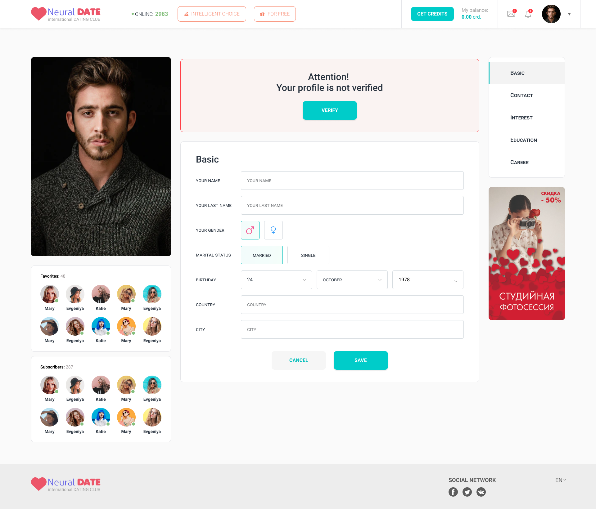
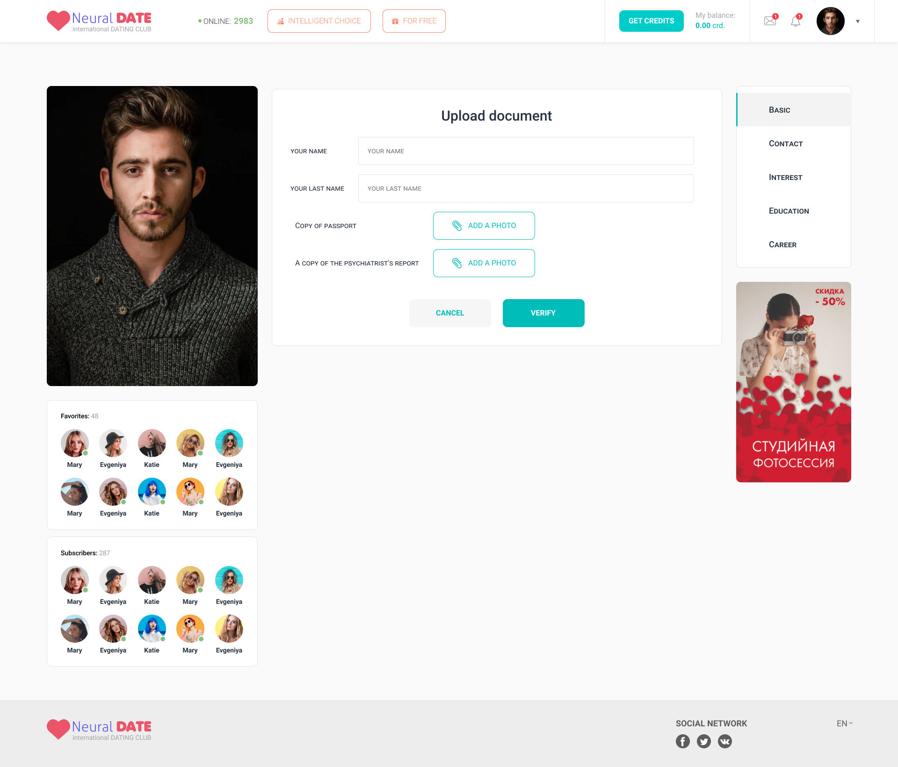

My profile.
==============

Edit page.

Verify page.

Detail page.

File structure.
================

main
    profile  

.. uml::

    @startsalt
    {
    {T
        +profile.component.html
        +profile.service.ts
        +profile.component.ts
        +profile.component.spec.ts
        +profile.module.ts
        +profile.component.scss
        +favorites/
        ++favorites.component.scss
        ++favorites.component.html
        ++favorites.component.ts
        +forgot-password/
        ++forgot-password.component.scss
        ++forgot-password.component.spec.ts
        ++forgot-password.component.ts
        ++forgot-password.component.html
        ++password-validation.ts
        +edit-profile/
        ++edit-profile.component.html
        ++edit-profile.component.scss
        ++edit-profile.component.ts
        ++edit-profile.component.spec.ts
        ++woman-form/
        +++woman-form.component.scss
        +++woman-form.component.ts
        +++woman-form.component.html
        +++woman-form.component.spec.ts
        ++man-form/
        +++man-form.component.scss
        +++man-form.component.ts
        +++man-form.component.html
        +++man-form.component.spec.ts
        ++agency-form/
        +++agency-form.component.html
        +++agency-form.component.spec.ts
        +++agency-form.component.ts
        +++agency-form.component.scss
        +upload-photo-dialog/
        ++upload-photo-dialog.component.ts
        ++upload-photo-dialog.component.html
        ++upload-photo-dialog.component.spec.ts
        ++upload-photo-dialog.component.scss
        +add-photo-dialog/
        ++add-photo-dialog.component.ts
        ++add-photo-dialog.component.scss
        ++add-photo-dialog.component.spec.ts
        ++add-photo-dialog.component.html
        +subscriptions/
        ++subscriptions.component.scss
        ++subscriptions.component.ts
        ++subscriptions.component.html

    }
    }
    @endsalt

Component diagramm.
====================

Detail page.

.. uml::

    @startuml

    [Base Component]

    
    [My photo Component]
    [Favorites Component]
    [Subscribers Component]
    

    [Info Component]
    [Gallery Component]
    [Feed Component] --> [Feed Item]
    

    database "NGRX store" {
      [Session]
    }

    
    [Base Component]-->HTTP1
    HTTP1-->[My photo Component]
    [Base Component]-->STORE
    STORE-->[Session]
    note left of HTTP1 : GET: account/myphoto

    [Base Component]-->HTTP2
    HTTP2-->[Favorites Component]
    note top of HTTP2 : GET: account/favorites

    [Base Component]-->HTTP3
    HTTP3-->[Subscribers Component]
    note top of HTTP3 : GET: account/subscribers

    [Base Component]-->HTTP4
    HTTP4-->[Info Component]
    note top of HTTP4 : GET: account/info

    [Base Component]-->HTTP5
    HTTP5-->[Feed Component]
    note top of HTTP5 : GET: account/feed
 
    [Base Component]-->HTTP6
    HTTP6-->[Gallery Component]
    note top of HTTP6 : GET: account/gallery

    @enduml

Profile service.

.. uml::

    @startuml
        class ProfileService {
        Observable<GET> getSubscriptionsList()
        Observable<GET> getFavoritesList()
        Observable<GET> getProfileDetail()
        Observable<POST> resetPassword()
        Observable<POST> saveProfile()
        Observable<POST> savePhoto()
        Observable<POST> saveDocuments()
        }

    @enduml

Store structire.

.. code::

    export interface SessionState {
    sid: string;
    token: string;
    is_auth: boolean;
    online: number;
    user: User;
    feed_ids: {[id: number]: Feed};
    photos: {[id: number]: Photo};
    favorite_ids: [id: number];
    subscribers_ids: [id: number]
    }    

Store relations.

.. uml::

    @startuml

        class SessionStore {
            int[] favorite_ids
            int[] subscribers_ids
            int[] feed_ids
        }

        class UserStore {
            int[] ids
            {[int]: obj} results
        }

        class FeedStore {
            int[] ids
            {[int]: obj} results        
        }

        SessionStore -- UserStore
        SessionStore -- FeedStore      

    @enduml